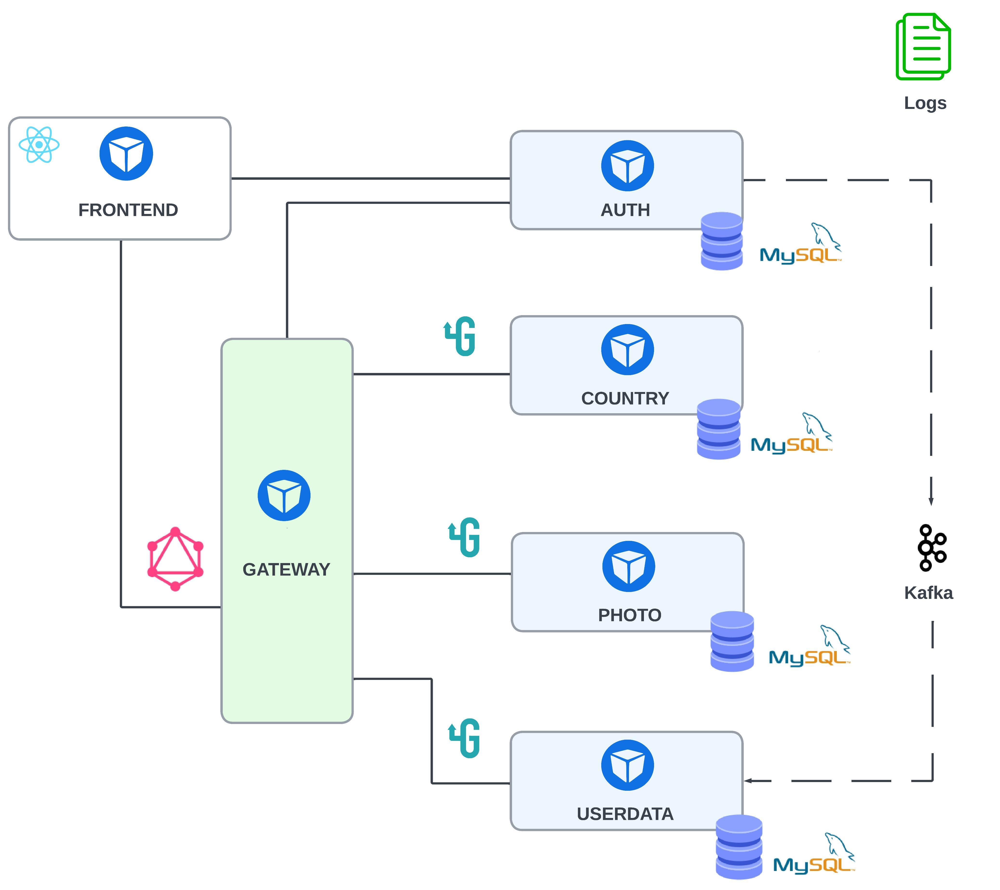
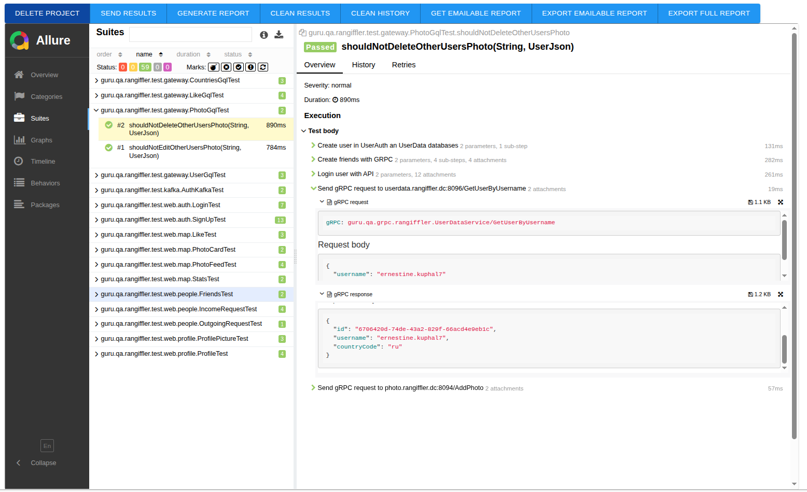

<p>

</p>

## Contents

- [Tools and Libraries](#tools-and-libraries-highlights)
- [Rangiffler Microservices Overview](#rangiffler-microservices-overview)
- [Running the Project Locally](#running-the-project-locally)
- [Running the Project in Isolation](#running-rangiffler-and-tests-in-isolation) 

>:information_source:   This testing project is for demonstration purposes only and covers only a limited part of the
> overall functionality.

This learning project focuses on exploring backend development and improving my skills in Java testing and related
tools

It was designed as a microservices-based web application “Rangiffler” - a simple social network for storing and sharing user photos

----

## Tools and Libraries Highlights

<p>

[](https://www.java.com/)
[](https://www.java.com/)
[](https://www.java.com/)
[](https://www.java.com/)
[](https://www.java.com/)
[](https://gradle.org/)
[](https://junit.org/junit5/)
[](https://ru.selenide.org/)
[](https://aerokube.com/selenoid/)
[](https://allurereport.org/)

</p>

### 🧩 Backend
- **Spring Boot ecosystem:** Spring Authorization Server, Spring OAuth 2.0 Resource Server, Spring Web, Spring Data JPA, Spring Actuator
- **Service communication:** gRPC for interaction between microservices
- **GraphQL** for communication between the frontend and the Gateway
- **Event streaming:** Apache Kafka for asynchronous communication between Auth and Userdata services
- **Database layer:** MySQL for data persistence
- **Containerization:** Docker & Docker Compose for local orchestration

### 💻 Frontend
- **React** for the main web interface
- **Thymeleaf** for server-side rendering in the Auth module

### ⚙️ Build & Environment
- **Java 21** as the core development platform
- **Gradle** for build automation and dependency management

### 🧪 Testing & Reporting
- **JUnit 5** (with custom Extensions and Resolvers) for backend and integration tests
- **Selenide** for UI automation
- **Apollo** for testing GraphQL queries and schema validation
- **Selenoid & Selenoid-UI** for browser virtualization in Docker
- **Allure & Allure Docker Service** for test reporting and visualization

----

## Rangiffler Microservices Overview

<p>

</p>

| **Service**  | **Port(s)** | **Communication**         | **Storage** | **Responsibility**                                                     | **Testing**            |
|--------------|-------------|---------------------------|-------------|------------------------------------------------------------------------|------------------------|
| **FRONTEND** | 80          | GraphQL to Gateway	       | -           | Client-side UI, browse content, share photos, interact with friends    | Test Framework (e2e)   |
| **GATEWAY**  | 8090        | GraphQL API, gRPC clients | -           | Main entry point, routes requests to microservices, JWT access control | Test Framework (e2e)   |
| **AUTH**     | 9000        | Web MVC, Kafka producer   | MySQL       | User authentication, credential storage, Kafka events                  | Unit tests             |
| **COUNTRY**  | 8091 / 8092 | gRPC                      | MySQL       | Countries data                                                         | Integration tests      |
| **PHOTO**    | 8093 / 8094 | gRPC                      | MySQL       | User photos, reactions (likes)                                         | Integration tests      |
| **USERDATA** | 8095 / 8096 | gRPC, Kafka consumer      | MySQL       | User info and friend lists                                             | Integration/Unit tests |


There are two ways to run the project:

1. **Local profile** - run backend and frontend directly on your machine using Gradle (backend) and npm (frontend)
2. **Docker profile** - run all services inside Docker containers, including tests, in a fully isolated environment

[↑ to contents](#contents)

----

## Running the Project Locally

### Step 1: Prerequisites

Make sure the following tools are installed:

- **Docker** (version 20.10 or higher)
- **Docker Compose** (included with Docker Desktop or available as `docker compose`)
- **Java 21**
- **Gradle Wrapper** (included in the project)
- **Node.js 18+** and **npm**

Verify installation by running:

```
docker --version
docker compose version
java -version
node -v
npm -v
```

### Step 2: Start Infrastructure (Local Profile)

From the project root, run the script:

- On Linux/Mac or Windows with Git Bash/WSL:
```
  ./docker-compose-local.sh
```
- On Windows Command Prompt or PowerShell, you need a `.bat` or `.ps1` version if not using Git Bash/WSL.

The script will automatically:

- Stop and remove old containers if they exist
- Start all required infrastructure: MySQL databases, Kafka and Zookeeper

> :information_source: DB data will be stored locally in Docker volumes, so it **persists between container restarts**.

---

### Step 3: Start Backend Services

Start **rangiffler-auth**:
```
./gradlew :rangiffler-auth:bootRun --args="--spring.profiles.active=local"
```
Start **rangiffler-country**:
```
./gradlew :rangiffler-country:bootRun --args="--spring.profiles.active=local"
```
Start **rangiffler-photo**
```
./gradlew :rangiffler-photo:bootRun --args="--spring.profiles.active=local"
```
Start **rangiffler-userdata**:
```
./gradlew :rangiffler-userdata:bootRun --args="--spring.profiles.active=local"
```
Start **rangiffler-gateway**:
```
./gradlew :rangiffler-gateway:bootRun --args="--spring.profiles.active=local"
```

> On Linux/Mac you can keep `./gradlew`, on Windows just use `gradlew` without `./`.

---

### Step 4: Start Frontend

Navigate to the frontend directory and start the application:
```
cd rangiffler-gql-client  
npm install  
npm run dev
```

After that, Rangiffler will be available at:

[http://localhost:3001](http://localhost:3001)

### Step 5: Run Tests

Now you can run tests **directly from your IDE**

[↑ to contents](#contents)

----

## Running Rangiffler and Tests in Isolation

### Step 1: Prepare the Infrastructure

1. **Login to a Docker Hub account.** 
   If you don't have one already, sign up for a free account at [Docker Hub](https://hub.docker.com/)

2. **Add aliases to your hosts file.** to resolve local domain names to the correct containers 
  
   Edit the `etc/hosts` file with administrator/root rights to add the following entries:

```
   127.0.0.1 frontend.rangiffler.dc
   127.0.0.1 auth.rangiffler.dc
   127.0.0.1 gateway.rangiffler.dc
```

### Step 2: Start Infrastructure

From the project root, run the script:

- **With tests** (end-to-end environment, includes test containers):

  ```
  bash docker-compose-e2e.sh
  ```

- **Without tests** (development environment, only services):

  ```
  bash docker-compose-dev.sh
  ```

>:information_source: Test data in this environment **will not be persisted** after stopping containers

After that, Rangiffler will be available at:  

[http://frontend.rangiffler.dc/](http://frontend.rangiffler.dc/)

When running environment with tests - Selenoid UI and Allure report are available

### Step 3: Access Selenoid UI and Allure Reports

**Selenoid UI** 

[http://localhost:9091/](http://localhost:9091/)

**Allure report**   
After tests finish, generated inside container with Allure Docker Service:

[http://127.0.0.1:5050/allure-docker-service/projects/rangiffler-e2e-tests/reports/latest/index.html](http://127.0.0.1:5050/allure-docker-service/projects/rangiffler-e2e-tests/reports/latest/index.html)

Each test is presented in the report as a series of steps with readable names

<p>

</p>

[↑ to contents](#contents)

----